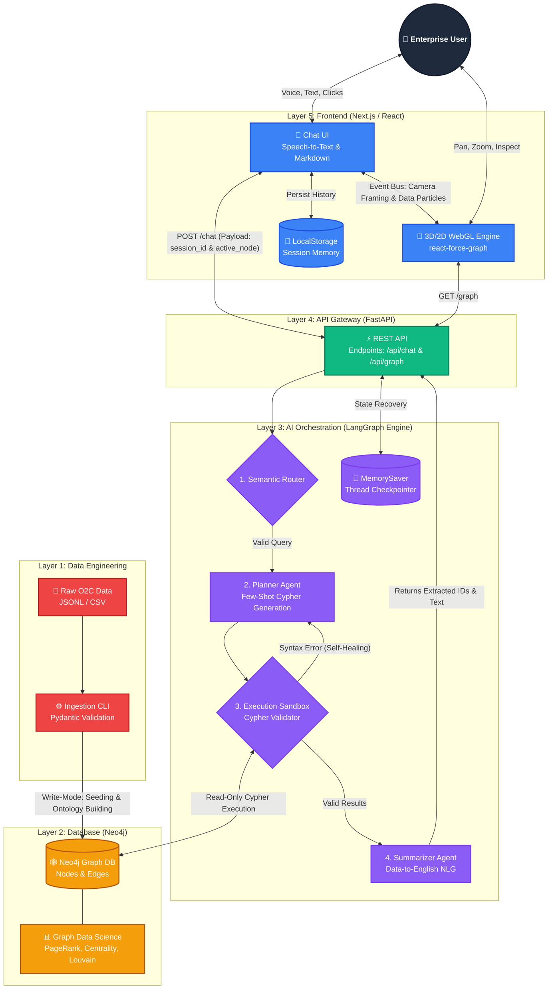
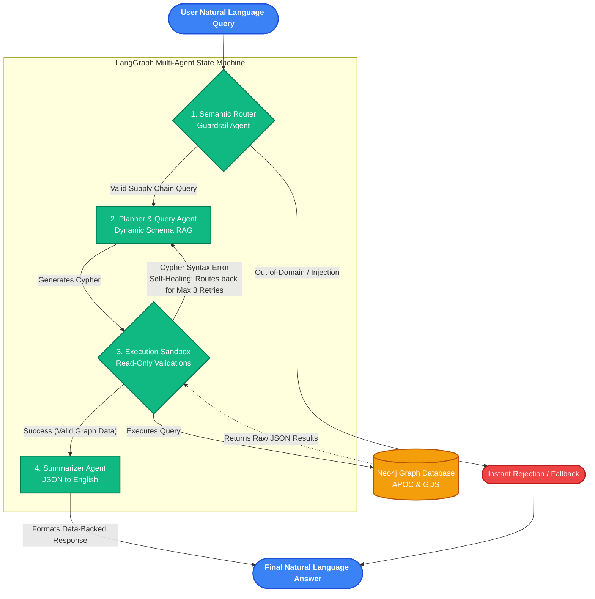

# 🕸️ Supply Chain Context Graph & AI Copilot

An enterprise-grade Graph-Based Data Modeling and Query System. This platform unifies fragmented SAP Order-to-Cash (O2C) tabular data into a highly interconnected Neo4j graph, providing a multi-agent LangGraph copilot to intuitively query, trace, and visualize the supply chain in real-time.

---



---

## ✨ System Highlights

- **Graph Construction (Data Unification):** Transforms fragmented tabular datasets (Orders, Deliveries, Invoices, Payments, Customers, Products) into a unified, directional property graph in Neo4j. It explicitly defines business entity nodes and maps their chronological relationships (e.g., `(SalesOrder)-[:CONTAINS]->(Product)`, `(Delivery)-[:FULFILLS]->(SalesOrder)`).
- **Interactive Graph Visualization:** A custom WebGL interface allows users to visually explore the supply chain. Users can click any node to expand it, inspect its full metadata via a dynamic HUD property card, and visually trace its relationships across the network.
- **Conversational Query Interface (Dynamic Cypher):** Utilizes a multi-agent LangGraph pipeline to accept natural language questions, dynamically translate them into structured Neo4j Cypher queries, execute them against the database, and return 100% data-backed, grounded responses.
- **Complex Query Resolution & Flow Tracing:** Capable of executing deep analytical queries, including aggregating high-volume billing products, tracing end-to-end Order-to-Cash flows (Sales Order → Delivery → Billing → Journal Entry), and isolating broken/incomplete supply chain flows.
- **Strict Domain Guardrails:** Built with a Semantic Router agent that acts as a strict security checkpoint. It actively analyzes intent and immediately rejects general knowledge questions, creative writing requests, and out-of-domain prompts, preventing LLM hallucinations.
- **Self-Healing AI Workflow:** A multi-agent LangGraph architecture that catches Cypher syntax errors and automatically retries and corrects its own queries before responding to the user.
- **Graph Data Science (GDS):** Pre-computed algorithms (PageRank, Degree Centrality, Louvain Modularity) expose deep mathematical insights (bottlenecks, influence, communities) directly to the LLM and the frontend UI.
- **Persistent Session Memory:** Full conversational memory stored in LangGraph's `MemorySaver` backend and synced with the browser's `localStorage` for a seamless, ChatGPT-style sidebar experience.

---

## 🚀 Quick Start Guide

### Prerequisites

- [Docker Desktop](https://docs.docker.com/get-docker/) (Ensure the daemon is running)
- An OpenAI API Key (`gpt-4o` recommended for complex graph routing)
- Node.js v18+ (If running the frontend locally outside of Docker)

### 1. Environment Configuration

Clone the repository and prepare the environment:

```bash
git clone <your-repo-url>
cd graph-query-system
cp .env.example .env
```

_Open `.env` and insert your `OPENAI_API_KEY`. The Neo4j Docker credentials are pre-configured._

### 2. Infrastructure Initialization

Spin up the complete stack (Neo4j + APOC/GDS, FastAPI Backend, Next.js Frontend):

```bash
docker compose up -d
```

_Wait ~45 seconds for Neo4j to fully allocate memory and open Bolt port 7687._

### 3. Data Ingestion & Graph Seeding

Run the automated CLI pipeline. This parses the raw JSONL datasets, validates the schema via Pydantic, builds the directional ontology, and executes the GDS algorithms:

```bash
docker exec -it backend-api python -m app.cli.seed_db
```

### 4. Access the Application

Navigate to **[http://localhost:3000](http://localhost:3000)**

---

## 📸 User Interface Overview


---

## 🧪 Evaluation Test Suite

To evaluate the functional requirements of this system, copy and paste the following tests directly into the Chat UI.

#### Test 1: Aggregation

> _"Which products are associated with the highest number of billing documents?"_

#### Test 2: Anomaly Detection / Broken Flows

> _"Find Sales Orders that have a Delivery, but do NOT have a Billing Document attached to them."_

#### Test 3: Structural Traversal

> _"Identify the top 3 supply chain bottlenecks and trace their complete transaction paths to see exactly what they are holding up."_
> _(Notice how the 3D camera automatically flies to frame the extracted bottleneck nodes)._

#### Test 4: Semantic Guardrails

> _"Can you write a creative poem about supply chains?"_
> _(The Semantic Router will instantly intercept and reject this)._

---

## 📂 Repository Architecture

```text
.
├── backend/                  # Python, FastAPI, LangGraph
│   ├── app/
│   │   ├── agents/           # State machine (workflow.py, state.py)
│   │   ├── api/              # REST endpoints (chat.py, graph.py)
│   │   ├── cli/              # Ingestion pipeline (seed_db.py)
│   │   └── core/             # Pydantic schemas
├── frontend/                 # Next.js, Tailwind, WebGL
│   ├── src/
│   │   ├── components/       # Chat.tsx, GraphView.tsx
│   │   └── app/              # page.tsx, globals.css
├── data/                     # Source JSONL/CSV datasets
├── docker-compose.yml        # Multi-container orchestration
└── ARCHITECTURE.md           # Engineering specifications
```

---

# 🏛️ System Architecture & Engineering Specifications

This document outlines the core design decisions, mathematical graph algorithms, and architectural tradeoffs made while building the Supply Chain Context Graph system.

---


## 1. Graph Data Modeling (Ontology)

### Design Decision: Directional Property Graph vs. RDBMS

Supply chain data (O2C) is inherently relational, but querying highly fragmented tabular data (e.g., tracing a Product -> Order -> Delivery -> Invoice -> Payment) requires expensive, exponentially slow SQL `JOIN` operations.
We modeled this as a **Directional Property Graph** in Neo4j. By storing relationships as physical memory pointers (Index-Free Adjacency), multi-hop traversals execute in milliseconds regardless of the total data volume.

**The Ontology:**

- **Nodes:** `Customer`, `Product`, `SalesOrder`, `Delivery`, `BillingDocument`, `JournalEntry`
- **Edges:** `PLACED`, `CONTAINS`, `FULFILLS`, `BILLED_FOR`, `POSTED_TO`

**Tradeoff:** Ingesting data into a graph database is slower and more complex than bulk-loading a SQL table. We accepted higher write-latency during the seeding phase (`seed_db.py`) to guarantee sub-second read-latency during AI query execution.

---

## 2. Advanced Graph Analytics (Neo4j GDS)

To give the LLM deeper context beyond simple lookups, we utilize Neo4j Graph Data Science (GDS) to pre-compute structural metrics.

- **Degree Centrality (Bottlenecks):** Measures the total inbound/outbound edges of a node.
  - _Implementation:_ Nodes with a score > 10 are flagged as bottlenecks. The UI uses this metric to conditionally render these nodes in **Amber**.
- **PageRank (Influence):** Evaluates the overall structural importance of a node within the transaction network.
  - _Implementation:_ The WebGL engine dynamically maps this float value to the radial size of the rendered nodes (`Math.max(node.pagerank_score * 15, 2)`).
- **Louvain Modularity (Community Clustering):** Detects dense subnetworks of related transactions.
  - _Implementation:_ Assigns a `community_id` integer to nodes, driving the categorical color mapping in the UI to visually separate isolated supply chain islands.

**Tradeoff:** We chose to pre-compute these algorithms during ingestion rather than running them on-the-fly. This uses slightly more storage space (adding properties to every node) but ensures the LLM and the frontend can retrieve complex analytics instantly without freezing the application.

---

## 3. Multi-Agent LLM Orchestration (LangGraph)

Instead of a fragile, single-prompt architecture, the AI backend utilizes a resilient State Machine built with **LangGraph**.



### The Agent Workflow:

1.  **Semantic Router (Guardrail):** A fast LLM classifier that inspects the query. If the user attempts prompt injection or asks out-of-domain questions, it routes directly to the end, skipping database execution.
2.  **Planner & Query Agent:** Dynamically constructs Neo4j Cypher queries.
    - _Design Decision:_ We utilize "Few-Shot Prompting" by injecting strict Cypher grammar rules (e.g., limiting `UNION` usage, enforcing `id` string lookups over `id(n)`) directly into the system prompt to prevent LLM hallucination.
3.  **Execution Sandbox (Self-Healing):** Executes the query against Neo4j.
    - _Design Decision:_ If a `CypherSyntaxError` occurs, the sandbox catches the exception and routes the exact error string _back_ to the Query Agent for a retry. This self-healing loop runs up to 3 times, drastically reducing user-facing errors for "Extreme Hard" analytical queries.
4.  **Summarizer:** Parses the raw Neo4j JSON and translates it into natural language.

---

## 4. Frontend & UI/UX

The frontend is a Next.js React application utilizing `react-force-graph` for WebGL rendering.

### Bidirectional State Sync

The most significant UI challenge was syncing the React DOM (Chat) with the HTML5 Canvas/WebGL engine (Graph).

- **Graph to Chat:** Clicking a 3D node stores its ID in React state. The next chat message appends this ID to the LangGraph payload, giving the AI spatial context ("Targeting Node: X").
- **Chat to Graph:** When the Summarizer Agent returns data, a regex parser extracts alphanumeric SAP IDs from the natural language response. An event bus (`window.dispatchEvent`) sends these IDs to the WebGL engine.

### Cinematic Camera Engine

When the graph receives highlighted IDs from the AI, it does not just change their color. The engine calculates the **Centroid** (center of mass) of the extracted nodes and their maximum spatial **Spread**, commanding the 3D camera to automatically sweep, zoom, and frame the exact results of the user's query.

---

## 5. Security & Data Protection

1.  **Strict Read-Only Execution:** The `driver.session(default_access_mode="READ")` is strictly enforced. Furthermore, the Sandbox Agent uses regex to actively block any query attempting `DELETE`, `DROP`, `MERGE`, or `SET`.
2.  **Massive Data Dump Prevention:** The Query Agent is instructed to silently append `LIMIT 50` to all aggregation queries, preventing the LLM from crashing the backend by attempting to summarize 100,000 JSON rows.
