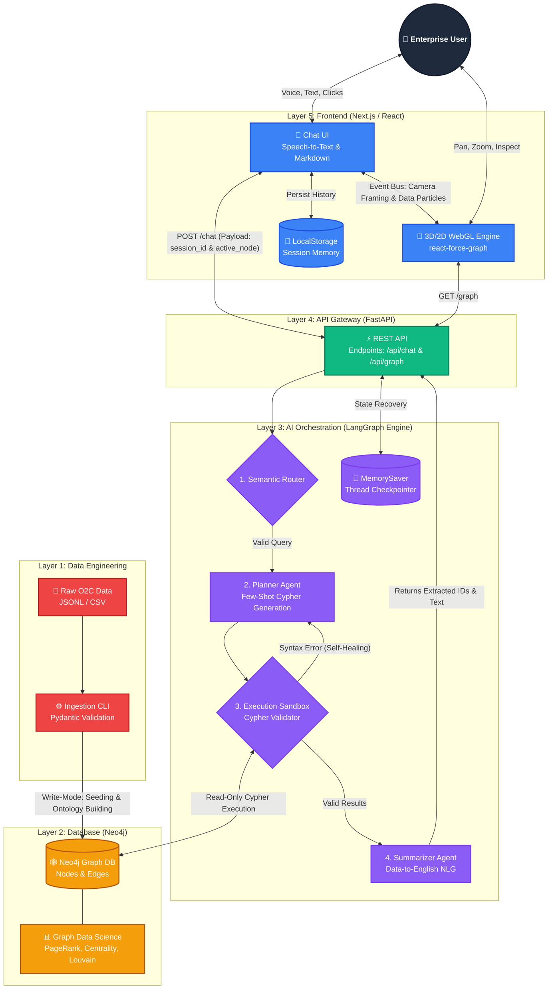

# 🕸️ Supply Chain Context Graph & AI Copilot

An enterprise-grade Graph-Based Data Modeling and Query System. This platform unifies fragmented SAP Order-to-Cash (O2C) tabular data into a highly interconnected Neo4j graph, providing a multi-agent LangGraph copilot to intuitively query, trace, and visualize the supply chain in real-time.

---



---

## ✨ System Highlights

- **Graph Construction (Data Unification):** Transforms fragmented tabular datasets (Orders, Deliveries, Invoices, Payments, Customers, Products) into a unified, directional property graph in Neo4j. It explicitly defines business entity nodes and maps their chronological relationships (e.g., `(SalesOrder)-[:CONTAINS]->(Product)`, `(Delivery)-[:FULFILLS]->(SalesOrder)`).
- **Interactive Graph Visualization:** A custom WebGL interface allows users to visually explore the supply chain. Users can click any node to expand it, inspect its full metadata via a dynamic HUD property card, and visually trace its relationships across the network.
- **Conversational Query Interface (Dynamic Cypher):** Utilizes a multi-agent LangGraph pipeline to accept natural language questions, dynamically translate them into structured Neo4j Cypher queries, execute them against the database, and return 100% data-backed, grounded responses.
- **Complex Query Resolution & Flow Tracing:** Capable of executing deep analytical queries, including aggregating high-volume billing products, tracing end-to-end Order-to-Cash flows (Sales Order → Delivery → Billing → Journal Entry), and isolating broken/incomplete supply chain flows.
- **Strict Domain Guardrails:** Built with a Semantic Router agent that acts as a strict security checkpoint. It actively analyzes intent and immediately rejects general knowledge questions, creative writing requests, and out-of-domain prompts, preventing LLM hallucinations.
- **Self-Healing AI Workflow:** A multi-agent LangGraph architecture that catches Cypher syntax errors and automatically retries and corrects its own queries before responding to the user.
- **Graph Data Science (GDS):** Pre-computed algorithms (PageRank, Degree Centrality, Louvain Modularity) expose deep mathematical insights (bottlenecks, influence, communities) directly to the LLM and the frontend UI.
- **Persistent Session Memory:** Full conversational memory stored in LangGraph's `MemorySaver` backend and synced with the browser's `localStorage` for a seamless, ChatGPT-style sidebar experience.

---

## 🚀 Quick Start Guide

### Prerequisites

- [Docker Desktop](https://docs.docker.com/get-docker/) (Ensure the daemon is running)
- An OpenAI API Key (`gpt-4o` recommended for complex graph routing)
- Node.js v18+ (If running the frontend locally outside of Docker)

### 1. Environment Configuration

Clone the repository and prepare the environment:

```bash
git clone <your-repo-url>
cd graph-query-system
cp .env.example .env
```

_Open `.env` and insert your `OPENAI_API_KEY`. The Neo4j Docker credentials are pre-configured._

### 2. Infrastructure Initialization

Spin up the complete stack (Neo4j + APOC/GDS, FastAPI Backend, Next.js Frontend):

```bash
docker compose up -d
```

_Wait ~45 seconds for Neo4j to fully allocate memory and open Bolt port 7687._

### 3. Data Ingestion & Graph Seeding

Run the automated CLI pipeline. This parses the raw JSONL datasets, validates the schema via Pydantic, builds the directional ontology, and executes the GDS algorithms:

```bash
docker exec -it backend-api python -m app.cli.seed_db
```

### 4. Access the Application

Navigate to **[http://localhost:3000](http://localhost:3000)**

---

## 📸 User Interface Overview

- **[Screenshot Placeholder: Main Split-Pane Layout showcasing the dark-mode 3D graph on the left and the Chat UI on the right.]**
- **[Screenshot Placeholder: The 'Execution Logic' accordion expanded, showing the generated Cypher and latency.]**
- **[Screenshot Placeholder: A zoomed-in view of a 'Bottleneck' node (Amber) with the dynamic property HUD card open.]**

---

## 🧪 Evaluation Test Suite

To evaluate the functional requirements of this system, copy and paste the following tests directly into the Chat UI.

#### Test 1: Aggregation

> _"Which products are associated with the highest number of billing documents?"_

#### Test 2: Anomaly Detection / Broken Flows

> _"Find Sales Orders that have a Delivery, but do NOT have a Billing Document attached to them."_

#### Test 3: Structural Traversal

> _"Identify the top 3 supply chain bottlenecks and trace their complete transaction paths to see exactly what they are holding up."_
> _(Notice how the 3D camera automatically flies to frame the extracted bottleneck nodes)._

#### Test 4: Semantic Guardrails

> _"Can you write a creative poem about supply chains?"_
> _(The Semantic Router will instantly intercept and reject this)._

---

## 📂 Repository Architecture

```text
.
├── backend/                  # Python, FastAPI, LangGraph
│   ├── app/
│   │   ├── agents/           # State machine (workflow.py, state.py)
│   │   ├── api/              # REST endpoints (chat.py, graph.py)
│   │   ├── cli/              # Ingestion pipeline (seed_db.py)
│   │   └── core/             # Pydantic schemas
├── frontend/                 # Next.js, Tailwind, WebGL
│   ├── src/
│   │   ├── components/       # Chat.tsx, GraphView.tsx
│   │   └── app/              # page.tsx, globals.css
├── data/                     # Source JSONL/CSV datasets
├── docker-compose.yml        # Multi-container orchestration
└── ARCHITECTURE.md           # Engineering specifications
```

---
